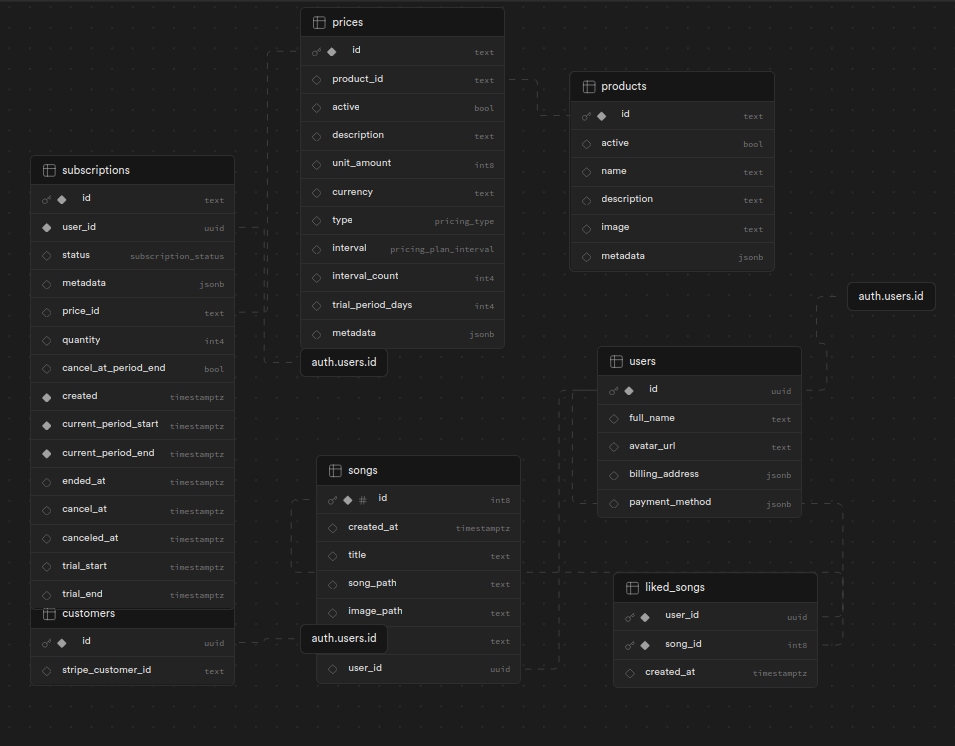
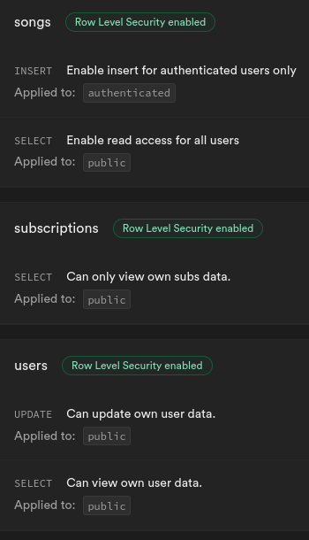

# Spotify Clone

[](https://github.com/Karo1808/SpotifyClone/blob/master/README.pl.md)

### Description

Spotify Clone is a web application that emulates the functionalities of the popular music streaming service, Spotify. Unlike Spotify, this clone does not rely on external APIs for song data; instead, it utilizes Supabase to create a song library, where all supported songs are uploaded by the users.

This web application was built following a [tutorial by CodeWithAntonio](https://youtu.be/2aeMRB8LL4o?si=RnJPKOE_O28fvBxE)

### Demo

[Website link](https://spotify-clone-seven-ochre.vercel.app/)

### Features

- Browsing Songs: Users can explore a library of songs available on the platform, which are added by users themselves.
- Adding Custom Songs: Users have the option to upload and add custom songs to their playlists, expanding the platform's library.
- User Authentication: Secure user authentication system ensures privacy and personalized experiences, with various authentication providers to choose from.
- Stripe Integration: Seamless integration with Stripe for handling payments and subscriptions.
- Playing Songs: Users can listen to their favorite songs with built-in player functionality.
- Liked Songs Functionality: Ability to mark songs as liked for quick access and personalized recommendations.

### Technologies Used

- Next.js 13: A React framework for building server-side rendered applications.
- Tailwind CSS: A utility-first CSS framework for creating custom designs with ease.
- TypeScript: A superset of JavaScript for enhanced code quality and developer productivity.
- Supabase: An open-source backend as a service utility, providing authentication services, database functionalities and file uploads.
- Stripe API: Integration with Stripe for handling payment processing and subscription management.
- Radix UI: a component library providing unstyled accessible components that can be styled freely.
- React hook form: simplifies creating forms with React
- Zustand: a lightweight state manager library for React

### Installation

Clone the repository locally

```bash
git clone https://github.com/Karo1808/SpotifyClone.git
```

Install the required dependencies

```bash
npm install
```

Create an .env.local file and add the following environment variables

```bash
STRIPE_WEBHOOK_SECRET=
STRIPE_SECRET_KEY=
NEXT_PUBLIC_STRIPE_PUBLISHABLE_KEY=

SUPABASE_SERVICE_ROLE_KEY=
NEXT_PUBLIC_SUPABASE_ANON_KEY=
NEXT_PUBLIC_SUPABASE_URL=
```

Create tables in supabase with this structure



Enable row level security based on the images below



Create storage buckets in supabase

```bash
songs
images
```

Run the website locally

```bash
npm run dev
```
