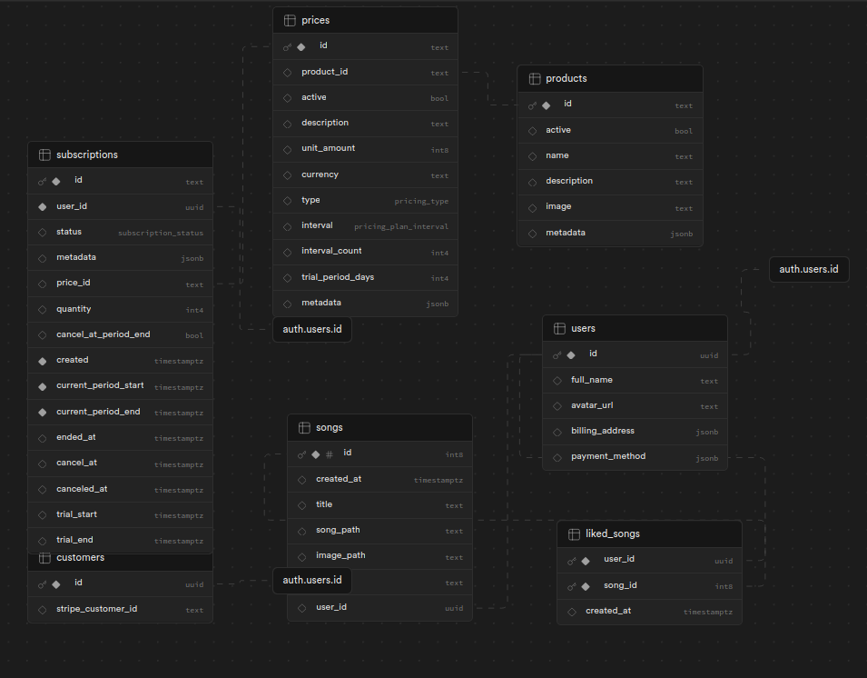
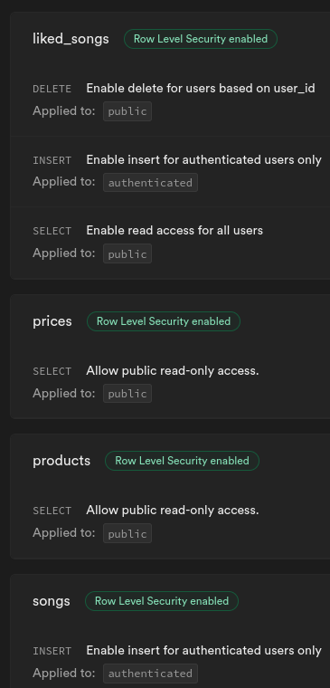

# Klon Spotify

[](https://github.com/Karo1808/SpotifyClone/blob/master/README.md)

### Opis

Klon Spotify aplikacja internetowa, która emuluje funkcjonalności popularnej usługi do słuchania muzyki, Spotify. W przeciwieństwie do Spotify, ten klon nie polega na zewnętrznych interfejsach API do danych o piosenkach; zamiast tego wykorzystuje Supabase do utworzenia biblioteki piosenek, w której wszystkie obsługiwane piosenki są przesyłane przez użytkowników.

### Funkcje

- Przeglądanie Piosenek: Użytkownicy mogą eksplorować bibliotekę dostępnych na platformie piosenek, które są dodawane przez samych użytkowników.
- Dodawanie Niestandardowych Piosenek: Użytkownicy mają możliwość przesyłania i dodawania niestandardowych piosenek do swoich list odtwarzania, poszerzając bibliotekę platformy.
- Uwietrzytelnianie Użytkownika: Bezpieczny system autentykacji użytkownika zapewnia prywatność i spersonalizowane doświadczenia, z różnymi dostawcami autentykacji do wyboru.
- Integracja ze Stripe: Bezproblemowa integracja ze Stripe do obsługi płatności i subskrypcji.
- Odtwarzanie Piosenek: Użytkownicy mogą słuchać swoich ulubionych piosenek za pomocą wbudowanej funkcji odtwarzacza.
- Funkcjonalność polubionych utworów: Możliwość oznaczania piosenek jako polubionych dla szybkiego dostępu.

### Użyte Technologie

- Next.js 13: Framework React do budowania aplikacji SSR.
- Tailwind CSS: Framework CSS typu utility-first do tworzenia spersonalizowanych projektów z łatwością.
- TypeScript: Nadzbiór JavaScriptu zapewniający lepszą jakość kodu i produktywność dewelopera.
- Supabase: Open source narzędzie backend as a service, dostarczające usługi autentykacji, funkcjonalności bazy danych i przesyłania plików.
- Stripe API: Integracja z Stripe do obsługi przetwarzania płatności i zarządzania subskrypcjami.
- Radix UI: biblioteka UI zapewniająca dostępne, nie stylizowane komponenty, które można dowolnie stylizować.
- React hook form: ułatwia tworzenie formularzy w React.
- Zustand: lekka biblioteka zarządzania stanem dla React.

### Instalacja

Sklonuj repozytorium lokalnie

```bash
git clone https://github.com/Karo1808/SpotifyClone.git
```

Zainstaluj wymagane zależności

```bash
npm install
```

Utwórz plik .env.local i dodaj następujące zmienne środowiskowe

```bash
STRIPE_WEBHOOK_SECRET=
STRIPE_SECRET_KEY=
NEXT_PUBLIC_STRIPE_PUBLISHABLE_KEY=
SUPABASE_SERVICE_ROLE_KEY=
NEXT_PUBLIC_SUPABASE_ANON_KEY=
NEXT_PUBLIC_SUPABASE_URL=
```

Utwórz tabele w supabase


Zezwól na zabezpieczenia na poziomie wiersza na podstawie obrakach poniżej



Utwórz kubełki przechowywania w Supabase

```bash
songs
images
```

Uruchom stronę lokalnie

```bash
npm run dev
```
